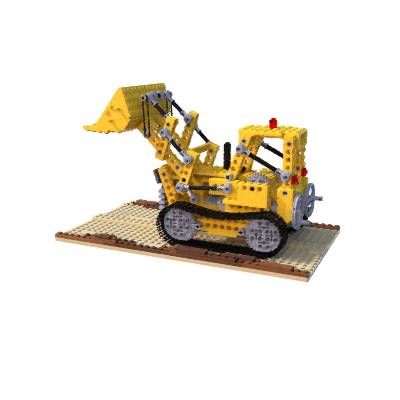

# NeRF_experiment

Explicit PyTorch implementation of NeRF

## Movement Demo
|       <h3 align="center"> move to right </h3>        |          <h3 align="center"> move in </h3>           |          <h3 align="center"> move up </h3>           |
|:----------------------------------------------------:|:----------------------------------------------------:|:----------------------------------------------------:|
|  |  |  |

## Method

[NeRF: Representing Scenes as Neural Radiance Fields for View Synthesis](http://tancik.com/nerf)  
[Ben Mildenhall](https://people.eecs.berkeley.edu/~bmild/)\*<sup>1</sup>,
[Pratul P. Srinivasan](https://people.eecs.berkeley.edu/~pratul/)\*<sup>1</sup>,
[Matthew Tancik](http://tancik.com/)\*<sup>1</sup>,
[Jonathan T. Barron](http://jonbarron.info/)<sup>2</sup>,
[Ravi Ramamoorthi](http://cseweb.ucsd.edu/~ravir/)<sup>3</sup>,
[Ren Ng](https://www2.eecs.berkeley.edu/Faculty/Homepages/yirenng.html)<sup>1</sup> <br>
<sup>1</sup>UC Berkeley, <sup>2</sup>Google Research, <sup>3</sup>UC San Diego  
\*denotes equal contribution


> A neural radiance field is a simple fully connected network (weights are ~5MB) trained to reproduce input views of a
> single scene using a rendering loss. The network directly maps from spatial location and viewing direction (5D input) to
> color and opacity (4D output), acting as the "volume" so we can use volume rendering to differentiably render new views

### Data Preparation

see [data/data_preparation.md](data/data_preparation.md)

### Train

```commandline
python run.py --config configs/lego.txt
```

### Render
to render a spherical path:
```commandline
python run.py --config configs/lego.txt --render_only
```
<figure>

</figure>

to render a view by the view direction and the sphere radius
```commandline
python run.py --config configs/lego.txt --render_a_view --render_params 66,-15,5
```
and you will get a result 'test.png':

<figure>

</figure>

## Citation

Kudos to the authors for their amazing results:

```
@misc{mildenhall2020nerf,
    title={NeRF: Representing Scenes as Neural Radiance Fields for View Synthesis},
    author={Ben Mildenhall and Pratul P. Srinivasan and Matthew Tancik and Jonathan T. Barron and Ravi Ramamoorthi and Ren Ng},
    year={2020},
    eprint={2003.08934},
    archivePrefix={arXiv},
    primaryClass={cs.CV}
}
```

## Acknowledge

This repo based on [nerf-pytorch](https://github.com/yenchenlin/nerf-pytorch).